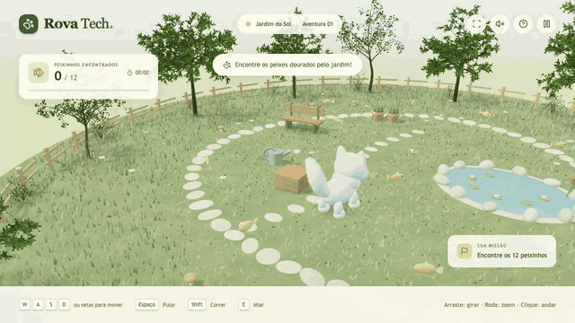
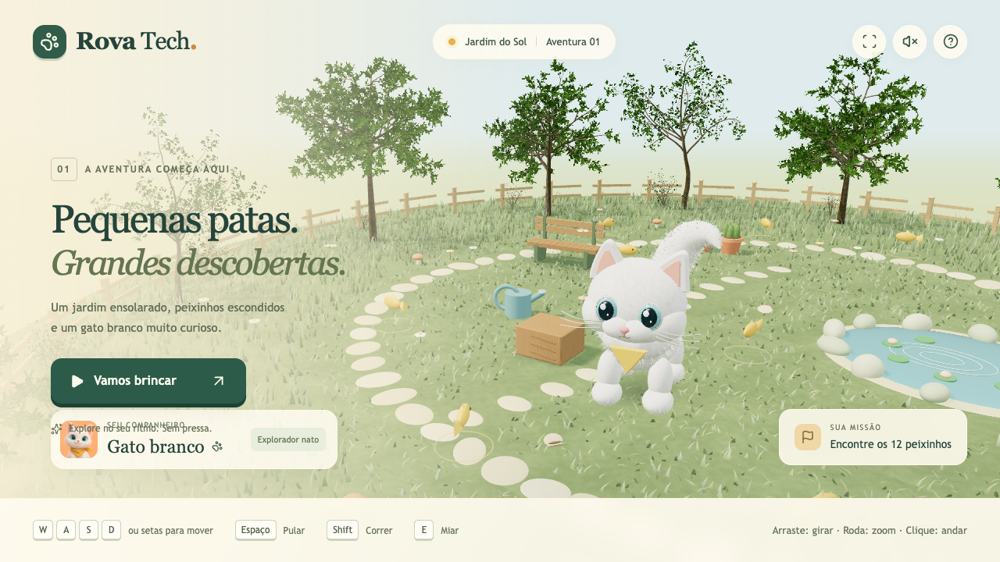
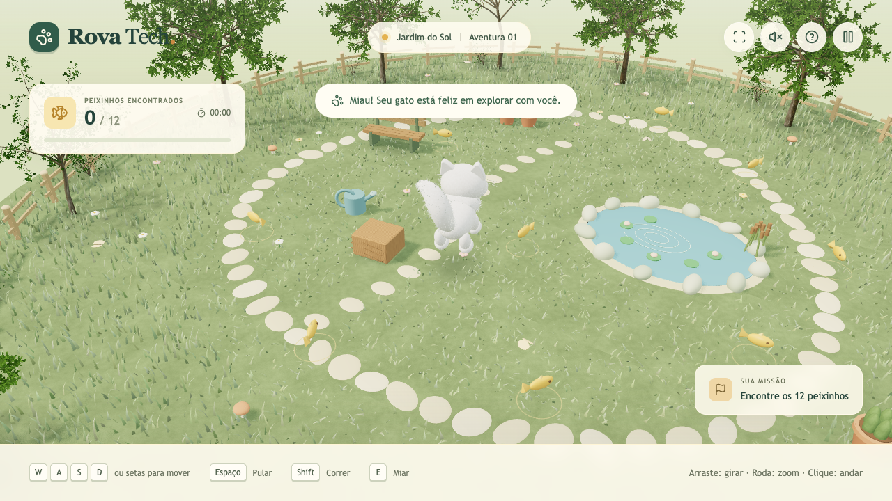
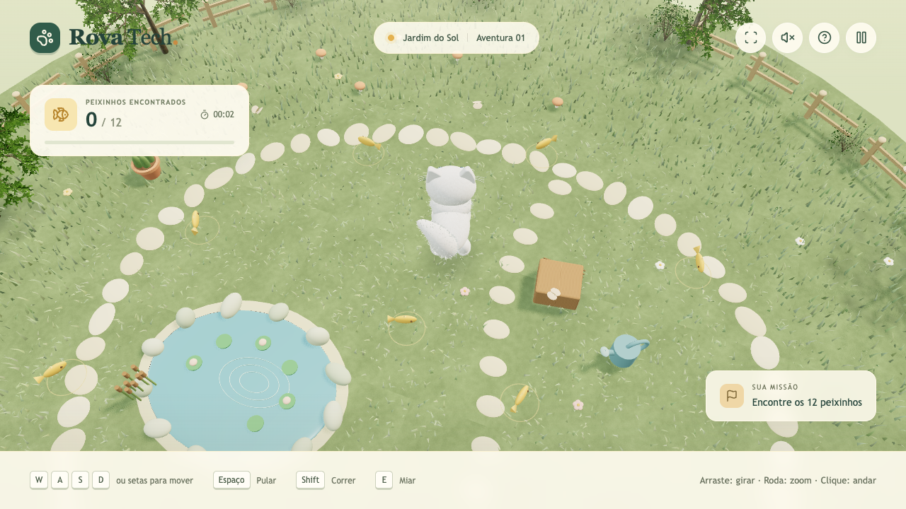
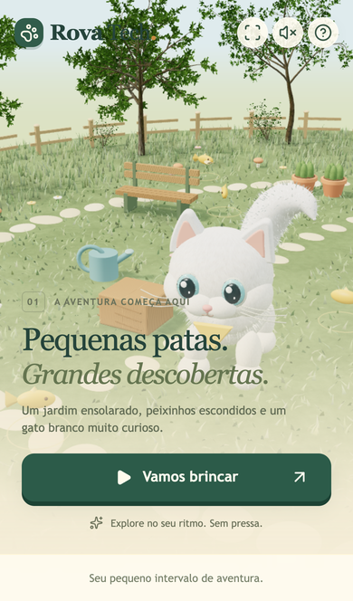

<div align="center">

### Pequenas patas. Grandes descobertas.

Um jardim ensolarado, doze peixinhos escondidos e um gato branco muito curioso.
Um joguinho 3D para jogar no navegador, sem instalar nada e sem pressa.

**[Jogar agora](https://rovatech-git.github.io/rova-tech/)**



</div>

---

## O que é

Você cuida de um gatinho branco de olhos azuis num jardim cheio de árvores, flores, um lago com vitórias-régias e peixinhos dourados espalhados pelo caminho de pedras. A missão é simples: **encontrar os 12 peixinhos**. Não tem limite de tempo nem inimigo. É só explorar no seu ritmo.

Funciona no computador e no celular, direto no navegador.

<table>
  <tr>
    <td width="50%"></td>
    <td width="50%"></td>
  </tr>
  <tr>
    <td align="center"><sub>A aventura começa aqui</sub></td>
    <td align="center"><sub>“Miau! Seu gato está feliz em explorar com você.”</sub></td>
  </tr>
  <tr>
    <td></td>
    <td align="center"></td>
  </tr>
  <tr>
    <td align="center"><sub>Gire a câmera e procure os peixinhos</sub></td>
    <td align="center"><sub>Também dá para jogar no celular</sub></td>
  </tr>
</table>

## Como jogar

| Ação | Teclado e mouse | Celular |
| --- | --- | --- |
| Andar | <kbd>W</kbd> <kbd>A</kbd> <kbd>S</kbd> <kbd>D</kbd> ou setas, ou um clique no chão | Setas na tela ou um toque no chão |
| Pular | <kbd>Espaço</kbd> | Botão **Pular** |
| Correr | <kbd>Shift</kbd> | — |
| Miar | <kbd>E</kbd> | Botão da patinha |
| Girar a câmera | Arrastar o mouse | Arrastar o dedo |
| Zoom | Roda do mouse ou trackpad | — |
| Restaurar a câmera | <kbd>R</kbd> | Botão no topo |
| Pausar | <kbd>Esc</kbd> ou <kbd>P</kbd> | Botão no topo |

> **Dica:** um clique curto move o gato; arrastar só mexe na câmera. O progresso vale para a partida atual e recomeça quando você recarrega a página.

## Rodar no seu computador

Você só precisa do [Node.js](https://nodejs.org/) 22.13 ou mais novo.

```bash
git clone https://github.com/rovatech-git/rova-tech.git
cd rova-tech
npx pnpm@11.25.0 install
npx pnpm@11.25.0 dev
```

Depois abra **http://localhost:5173**. Não precisa de chave de API nem de conta.

## Onde mexer

Quer mudar alguma coisa? Estes são os arquivos principais:

| Arquivo | O que tem lá |
| --- | --- |
| [`app/world.ts`](app/world.ts) | O coração do jogo: gato, cenário, câmera, animações, colisões e coleta |
| [`app/page.tsx`](app/page.tsx) | Interface, menus, pontuação e controles na tela |
| [`app/vegetation.ts`](app/vegetation.ts) | Árvores, arbustos e grama gerados por código |
| [`app/cat-coat.ts`](app/cat-coat.ts) | Os pelos fofinhos do pescoço e do rabo |
| [`app/appearance.ts`](app/appearance.ts) | Texturas, orelhas e sombras |
| [`app/camera-controls.ts`](app/camera-controls.ts) | Zoom, rotação e a diferença entre clique e arraste |
| [`app/scene-performance.ts`](app/scene-performance.ts) | Truques de desempenho e resolução adaptável |
| [`app/software-renderer.ts`](app/software-renderer.ts) | Plano B para navegadores sem WebGL2 |
| [`app/globals.css`](app/globals.css) | Visual da interface e ajustes para celular |

**Feito com:** React, TypeScript, Three.js e Vite.

## Publicação

Cada `push` na branch `main` publica o jogo automaticamente no GitHub Pages, pelo fluxo [`.github/workflows/github-pages.yml`](.github/workflows/github-pages.yml). Para gerar a versão estática na sua máquina:

```bash
npx pnpm@11.25.0 build:pages   # o resultado fica em dist-pages/
```

<details>
<summary><b>Detalhes do visual</b></summary>

<br>

O gato tem cabeça e bochechas arredondadas, barriga e patinhas cheias, orelhas pequenas e pupilas redondas. O pescoço ganhou uma gola de pelos e o rabo parece uma pluma com a ponta curva. Esses pelos ficam em só duas malhas, sem simular cada fio, o que mantém o jogo leve.

As árvores usam galhos recursivos e folhas recortadas, com copas assimétricas, casca texturizada e um balanço suave. A grama é feita de lâminas curvas reunidas numa única malha, e há sombras irregulares sob as copas.

Com WebGL2, o jogo usa luz ambiente, materiais e sombras. Em aparelhos sem WebGL2, entra um renderizador alternativo que mantém as mesmas árvores, texturas e profundidade 3D, com iluminação mais simples.

</details>

<details>
<summary><b>Câmera e desempenho</b></summary>

<br>

- Objetos repetidos do jardim são agrupados por geometria e material.
- Sombras fixas são calculadas uma vez só.
- A densidade de pixels se ajusta sozinha à carga da GPU, sem perder modelos, texturas nem antialiasing.
- No modo sem WebGL, o cenário parado é reaproveitado e a resolução cai um pouco só enquanto a câmera se mexe.

Na versão anterior, medida num navegador sem WebGL, o primeiro quadro caiu de cerca de 222 ms para 27 ms, e uma caminhada longa caiu de cerca de 204 ms para 94 ms por quadro. Esses tempos valem para aquele ambiente de teste, não são uma garantia de FPS em outros aparelhos.

</details>

## Créditos

- A vegetação usa o [EZ-Tree](https://github.com/dgreenheck/ez-tree), de Daniel Greenheck, sob licença MIT. Veja [`THIRD_PARTY_NOTICES.md`](THIRD_PARTY_NOTICES.md).
- O retrato do gato e a textura de pelo foram criados especialmente para este jogo.
- As demais dependências mantêm suas próprias licenças.

<div align="center">
<br>
<sub>Feito com carinho pela <b>Rova Tech</b> · <a href="https://rovatech-git.github.io/rova-tech/">jogar agora</a></sub>
</div>
